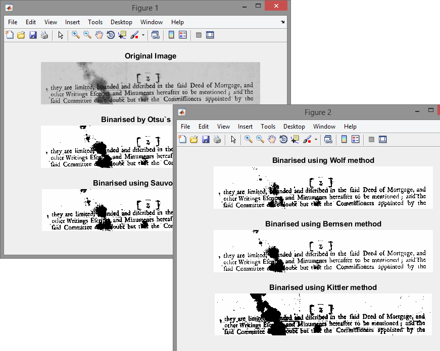

# BinarizationAlgorithms

 Just 10 binarization algorithms in MatLab
  All of them have been found in the net in free access (and slightly modified)

Thanks matwork users for sharing and code implementation:

Jan Motl (https://www.mathworks.com/matlabcentral/profile/authors/3909588-jan-motl);  
Image Analyst (https://www.mathworks.com/matlabcentral/profile/authors/1343420-image-analyst);  
sundus (https://www.mathworks.com/matlabcentral/profile/authors/4215217-sundus)

Main.m perform all of the algorithms and displaying the results (on a test image test.bmp)

Output:

 
  

